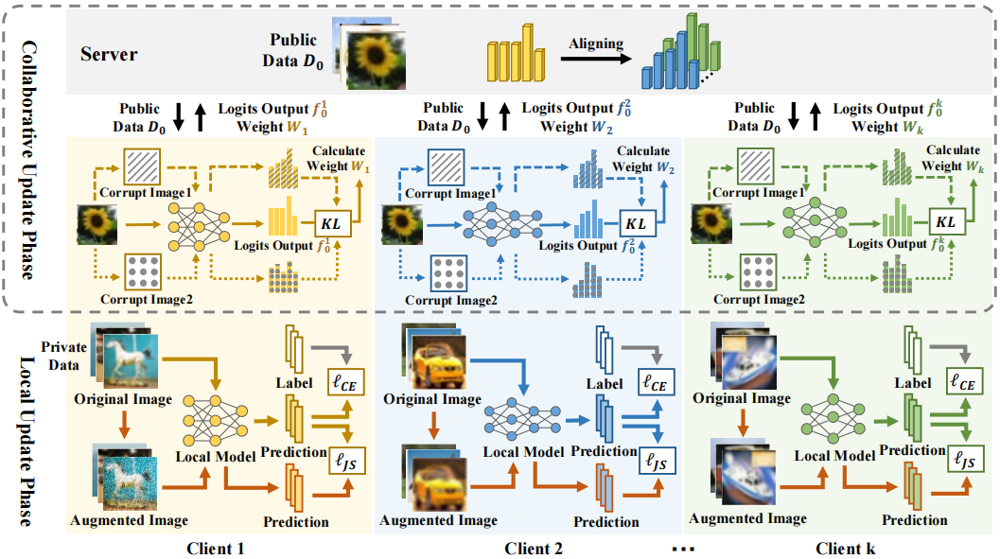

# AugHFL 描述

AugHFL（增强异构联邦学习）是一个联邦学习框架，用于研究模型异构联邦学习中的数据损坏问题：

1.处理本地数据损坏的本地学习。

2.鲁棒的损坏客户端交流。

# 模型架构



# 数据集

使用的数据集：[CIFAR-10](<https://www.cs.toronto.edu/~kriz/cifar-10-python.tar.gz>)、[CIFAR-10-C](https://zenodo.org/records/2535967)、[CIFAR-100](<https://www.cs.toronto.edu/~kriz/cifar-100-python.tar.gz>)

## CIFAR-10

- 数据集大小：178 MB，由6万张32\*32的彩色图片组成，一共有10个类别。每个类别6000张图片
    - 训练集：148 MB，共50000组图像
    - 测试集：29.6 MB，共10000组图像

- 数据格式：用cPickle生成的python pickled对象
    - 注：数据将在src/init_data.py中加载和处理。

## CIFAR-100

- 数据集大小：178 MB，由6万张32\*32的彩色图片组成，一共有100个类别。每个类别600张图片
    - 训练集：148 MB，共50000组图像
    - 测试集：29.6 MB，共10000组图像

- 数据格式同上

- 数据目录树：官网下载数据后，解压压缩包，训练和评估所需的数据目录结构如下：

```shell
├─cifar-10-batches-py
│  ├─batches.meta
│  ├─data_batch_1
│  ├─data_batch_2
│  ├─data_batch_3
│  ├─data_batch_4
│  ├─data_batch_5
│  ├─readme.html
│  └─test_batch
│
└─cifar-100-python
   ├─file.txt~
   ├─meta
   ├─test
   └─train
```

# 环境要求

- 硬件（Ascend）
    - 使用Ascend处理器来搭建硬件环境。
- 框架
    - [MindSpore](https://gitee.com/link?target=https%3A%2F%2Fwww.mindspore.cn%2Finstall)
- 如需查看详情，请参见如下资源：
    - [MindSpore教程](https://gitee.com/link?target=https%3A%2F%2Fwww.mindspore.cn%2Ftutorials%2Fzh-CN%2Fmaster%2Findex.html)
    - [MindSpore Python API](https://gitee.com/link?target=https%3A%2F%2Fwww.mindspore.cn%2Fdocs%2Fzh-CN%2Fmaster%2Findex.html)

## 快速入门

通过官方网站安装MindSpore后，您可以按照如下步骤进行训练和评估。

```shell
# 初始化数据集
python init.py
# 预训练本地模型
python pretrain.py
# AugHFL
python aughfl.py
# 评估
python eval.py
```

# 脚本说明

## 脚本和样例代码

```shell
├── AugHFL_mindspore
    ├── src                 数据集和模型相关工具
        ├── augmentations.py    生成损坏数据集的各种增强操作
        ├── cifar.py            数据集基类
        ├── dataaug.py          augmix操作
        ├── init_data.py        数据集初始化类
        ├── make_cifar_c.py     生成CIFAR10-C
        ├── utils.py            相关工具
        ├── frost1.png          frost增强图片1
        ├── frost2.png          frost增强图片2
        ├── frost3.png          frost增强图片3
        ├── frost4.jpg          frost增强图片4
        ├── frost5.jpg          frost增强图片5
        ├── frost6.jpg          frost增强图片6
        ├── efficientnet.py     客户机网络模型
        ├── resnet.py           客户机网络模型
        └── shufflenet.py       客户机网络模型
    ├── pretrain.py         预训练脚本
    ├── aughfl.py             联邦训练脚本
    ├── init.py             数据集初始化脚本
    ├── eval.py             评估脚本
    ├── export.py           导出模型脚本
    ├── loss.py             损失函数
    └── config.yaml         训练参数
```

## 脚本参数

在config.yaml中可以同时配置训练参数和评估参数。

可以直接查看config.yaml内的配置说明，说明如下

```yaml
n_participants:  客户机数目
corruption_type:  选择损坏或损坏['clean',‘random_noise',None]
corruption_rate:  损坏率

pretrain: 预训练相关参数
    train_batch_size: 训练batch大小
    test_batch_size: 测试batch大小
    pretrain_epoch: 预训练每个客户机迭代轮数
    private_data_len: 私有数据集长度
    pariticpant_params:
        loss_funnction: 损失函数
        optimizer_name: 优化器
        learning_rate: 初始学习率


aughfl: 联邦训练相关参数
    train_batch_size: 训练batch大小
    test_batch_size: 测试batch大小
    communication_epoch: 联邦训练轮数
    private_data_len: 私有数据集长度
    public_dataset_length: 公共数据集长度
    pariticpant_params:
        loss_funnction: 损失函数
        optimizer_name: 优化器
        learning_rate: 初始学习率
```

# 训练过程

在昇腾上运行下面的命令进行训练

```shell
# 预训练本地模型
python pretrain.py
# AugHFL
python aughfl.py
```

# 评估

在昇腾上运行下面的命令进行评估

```shell
python eval.py
```


# 导出

```shell
# 导出MINDIR和AIR
python export.py
```


# 推理

```shell
python eval.py
```


# 性能

## 训练性能

| Parameters                 | Ascend 910                                                   |
| -------------------------- | ------------------------------------------------------------ |
| Model Version              | ResNet10 ResNet12 ShuffleNet  Mobilenetv2                    |
| Resource                   | NPU: 1*Ascend 910, CPU: 24, Video Memory: 32GB, Memory: 256GB|
| uploaded Date              | 02/26/2024                                                   |
| MindSpore Version          | 1.8.1                                                        |
| Dataset                    | CIFAR-10-C                                                   |
| Training Parameters        | train_batch_size: 512    test_batch_size: 512    communication_epoch: 40 |
| Optimizer                  | Adam                                                         |
| Loss Function              | CE                                                           |
| Speed                      | 1700 ms/step                                                 |
| Total time                 | 8hours                                                       |
| Checkpoint for Fine tuning | 56.9M (four .ckpt files)                                     |

## 推理性能

| Parameters          | Ascend                                                       |
| ------------------- | ------------------------------------------------------------ |
| Model Version       | ResNet10 ResNet12 ShuffleNet  Mobilenetv2                    |
| Resource            | NPU: 1*Ascend 910, CPU: 24, Video Memory: 32GB, Memory: 256GB |
| Uploaded Date       | 02/26/2024                                                   |
| MindSpore Version   | 1.8.1                                                        |
| Dataset             | CIFAR-10-C                                                   |
| batch_size          | 512                                                          |
| Accuracy            | 70.03%                                                       |
| Model for inference | 56.9M (four .air files)                                      |

# 随机情况说明

在pretrain.py, aughfl.py，eval.py中，我们设置了random.seed(0)和np.random.seed(0)种子。

# 贡献指南

如果你想参与贡献昇思的工作当中，请阅读[昇思贡献指南](https://gitee.com/mindspore/models/blob/master/CONTRIBUTING_CN.md)和[how_to_contribute](https://gitee.com/mindspore/models/tree/master/how_to_contribute)


# ModelZoo 主页

请浏览官方[主页](https://gitee.com/mindspore/models)。
