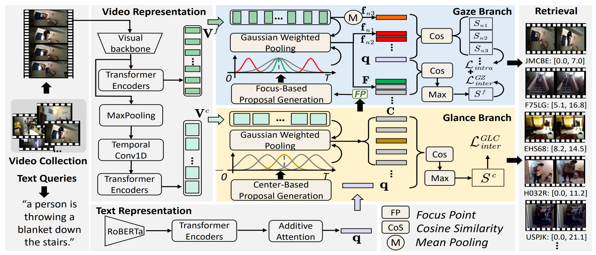

# Introduction
MindSpore implementation for ACM MM2023 paper:

Joint Searching and Grounding: Multi-Granularity Video Content Retrieval


> The codes are modified from [TVR](https://github.com/jayleicn/TVRetrieval) and [MS-SL](https://github.com/HuiGuanLab/ms-sl)

# Git Branch
Please checkout the mindspore branch for mindspore version implementation:
```
git checkout mindspore
```

# Environments 
* **python 3.9.18**
* **tqdm 4.65.0**
* **easydict 1.9**
* **h5py 3.1.0**
* **cuda 12.1**
* **numpy 1.22.3**
* **cudatoolkit 11.1.1**

# Data Preparation
The data split files, textual RoBERTa features and visual features of Charades-STA dataset can be downloaded from [Baidu Cloud Disk](https://pan.baidu.com/s/1B9fK8fA7Hy_1NTZ2m1DBCg?pwd=e8cy) or [Google Drive](https://drive.google.com/file/d/181wKl3GjgmcULv0ps0XGyMvndJTrIpN1/view?usp=sharing). The directory structure is expected to be the following:
```
data
|-- charades
|   |-- TextData
|   |-- charades_i3d_rgb_lgi.hdf5
```

# Training and Evaluation

## Training
Run the following scripts to train `JSG` on the corresponding dataset and subtask.

```
#Add project root to PYTHONPATH (Note that you need to do this each time you start a new session.)
source setup.sh

EXP_ID=train_jsg
GPU_DEVICE_ID=0
ROOTPATH=$HOME/data

./charades.sh $EXP_ID $GPU_DEVICE_ID $ROOTPATH
```

## Evaluation
The model is placed in the directory $ROOTPATH/$DATASET/results/$MODELDIR after training. Run the following script to evaluate it(Suppose the model is trained on Charades-STA):
```
DATASET=charades
EVALID=eval_jsg
ROOTPATH=$HOME/data
MODELDIR=xxx

./test.sh $DATASET $EVALID $ROOTPATH $MODELDIR
```