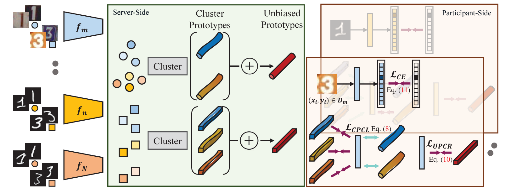

# Rethinking Federated Learning with Domain Shift: A Prototype View (MindSpore Version)
This repo is the MindSpore implementation of Federated Prototype Learning.

> Rethinking Federated Learning with Domain Shift: A Prototype View,            
> Wenke Huang, Mang Ye, Zekun Shi, He Li, Bo Du
> *CVPR, 2023*
> [Link](https://openaccess.thecvf.com/content/CVPR2023/papers/Huang_Rethinking_Federated_Learning_With_Domain_Shift_A_Prototype_View_CVPR_2023_paper.pdf)

## FPL Abstract

Federated learning shows a bright promise as a privacy-preserving collaborative learning technique. However, prevalent solutions mainly focus on all private data sampled from the same domain. An important challenge is that when distributed data are derived from diverse domains. The private model presents degenerative performance on other domains (with domain shift). Therefore, we expect that the global model optimized after the federated learning process stably provides generalizability performance on multiple domains. In this paper, we propose Federated Prototypes Learning (FPL) for federated learning under domain shift. The core idea is to construct cluster prototypes and unbiased prototypes, providing fruitful domain knowledge and a fair convergent target. On the one hand, we pull the sample embedding closer to cluster prototypes belonging to the same semantics than cluster prototypes from distinct classes. On the other hand, we introduce consistency regularization to align the local instance with the respective unbiased prototype. Empirical results on Digits and Office Caltech tasks demonstrate the effectiveness of the proposed solution and the efficiency of crucial modules.

## Framework Architecture


## Dataset
This paper uses the Digits datasets as multi-domain datasets. 
Digits includes the MNIST, SVHN, USPS, and SYN datasets.
Download Link

## Environment Requirements

Hardware

* Any GPU is acceptable. (NVIDIA RTX 3090 is recommended)

Framework

* [MindSpore 2.1.0](https://gitee.com/mindspore/mindspore)


Requirements

* numpy
* tdqm
* scikit-learn

For more information, please check the resources below：

- [MindSpore Tutorials](https://www.mindspore.cn/tutorials/en/master/index.html)
- [MindSpore Python API](https://www.mindspore.cn/docs/api/en/master/index.html)

## Quick Start

```
python main.py --model fpl
```


## Citation
```
@inproceedings{HuangFPL_CVPR2023,
    author    = {Huang, Wenke and Mang, Ye and Shi, Zekun and Li, He and Bo, Du},
    title     = {Rethinking Federated Learning with Domain Shift: A Prototype View},
    booktitle = {CVPR},
    year      = {2023}
}
```