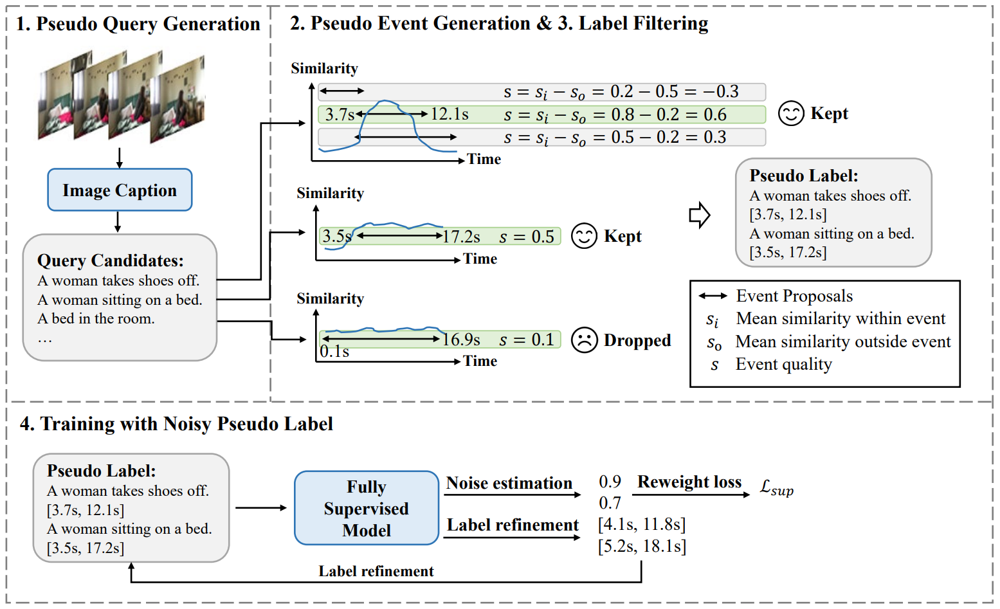
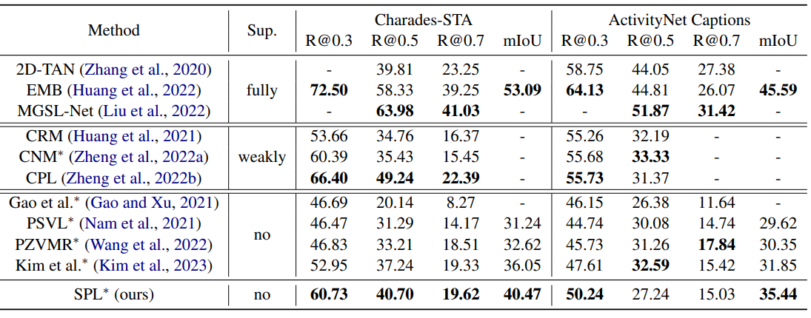

# SPL: Generating Structured Pseudo Labels for Noise-resistant Zero-shot Video Sentence Localization

In this work, we propose the Structurebased Pseudo Label generation (SPL) framework for the zero-shot video sentence localization task, which learns with only video data without any annotation. 
We first generate free-form interpretable pseudo queries before constructing query-dependent event proposals by modeling the event temporal structure. To mitigate the effect of pseudolabel noise, we propose a noise-resistant iterative method that repeatedly re-weight the training sample based on noise estimation to train a grounding model and correct pseudo labels.
Experiments on the ActivityNet Captions and Charades-STA datasets demonstrate the advantages of our approach.

Our paper was accepted by ACL-2023. [[Paper]](https://aclanthology.org/2023.acl-long.794/) [[Project]](https://minghangz.github.io/publication/spl/)



## Main Results



## Environments

- python==3.9
- mindspor==2.2
- numpy
- nltk
- scikit-learn
- h5py
- tqdm

## Generate Pseudo Labels (optional)

We provide the generated pseudo labels for the ActivityNet Captions and Charades-STA datasets in `EMB/data/dataset/activitynet/train_pseudo.json` and `EMB/data/dataset/charades/charades_sta_train_pseudo.txt`. 

If you only need to verify the model's performance or use the pseudo-labels we have generated to train the model, please skip this step.

If you need to generate pseudo labels by yourself, please follow the instructions.

### Step 1. Prepare Data

We use the [BLIP](https://github.com/salesforce/BLIP) model to generate pseudo labels. We provide pre-extracted BLIP captions and features at [this link](https://pan.baidu.com/s/1ys2WX78r6ym1wsFj4JRuXg?pwd=59yu). Please download the BLIP captions and features.

### Step 2. Generate Pseudo Labels

To generate the pseudo labels, please run:

```bash
# Charades-STA
python pseudo_label_generation.py --dataset charades --video_feat_path PATH_TO_SAVED_VISUAL_FEATURES --caption_feat_path PATH_TO_SAVED_CAPTION_FEATURES --caption_path PATH_TO_SAVED_CAPTIONS

# ActivityNet Captions
python pseudo_label_generation.py --dataset activitynet --num_stnc 4 --stnc_th 0.9 --stnc_topk 1 --video_feat_path PATH_TO_SAVED_VISUAL_FEATURES --caption_feat_path PATH_TO_SAVED_CAPTION_FEATURES --caption_path PATH_TO_SAVED_CAPTIONS
```

Note: On the ActivityNet Captions dataset, due to the low efficiency of the sliding window method for generating event proposals, we pre-reduced the number of event proposals by clustering features. The processed proposals are stored in `data/activitynet/events.pkl`. The preprocessing script is `event_preprocess.py`.

## Quick Start

### Preparation

We use [EMB](https://github.com/Raymond-sci/EMB) as our grounding model and train it using our generated pseudo labels.

Please download the pre-trained video features from [here](https://app.box.com/s/h0sxa5klco6qve5ahnz50ly2nksmuedw) and word embeddings from [here](https://nlp.stanford.edu/data/glove.840B.300d.zip), then put them in `EMB/data/features`.

### Training

To train EMB with generated pseudo labels, please run:
```bash
cd EMB

# Charades-STA
python main.py --task charades --mode train --deploy

# ActivityNet Captions
python main.py --task activitynet --mode train --deploy
```

### Evaluation

Download our trained models from [here](https://drive.google.com/drive/folders/1qVHUSjC6gY_S8eW7IgZC5rxrtSB3vBE9?usp=sharing) and put them in `EMB/sessions/`. Create the `session` folder if not existed.

To evaluate the trained model, please run:

```bash
cd EMB

# Charades-STA
python main.py --task charades --mode test --model_name SPL

# ActivityNet Captions
python main.py --task activitynet --mode test --model_name SPL
```

## Acknowledege

We appreciate [EMB](https://github.com/Raymond-sci/EMB) for its implementation. We use EMB as our grounding model.

## Citation

```
@inproceedings{zheng-etal-2023-generating,
    title = "Generating Structured Pseudo Labels for Noise-resistant Zero-shot Video Sentence Localization",
    author = "Zheng, Minghang  and
      Gong, Shaogang  and
      Jin, Hailin  and
      Peng, Yuxin  and
      Liu, Yang",
    booktitle = "Proceedings of the 61st Annual Meeting of the Association for Computational Linguistics (Volume 1: Long Papers)",
    month = jul,
    year = "2023",
    address = "Toronto, Canada",
    publisher = "Association for Computational Linguistics",
    url = "https://aclanthology.org/2023.acl-long.794",
    pages = "14197--14209",
}
```
