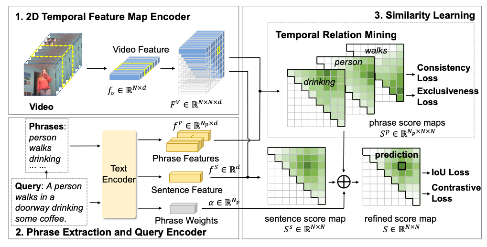

# TRM: Phrase-level Temporal Relationship Mining for Temporal Sentence Localization
> Mindspore implementation of Phrase-level Temporal Relationship Mining for Temporal Sentence Localization (AAAI2023).

```
@inproceedings{zheng2023phrase,
  title={Phrase-level temporal relationship mining for temporal sentence localization},
  author={Zheng, Minghang and Li, Sizhe and Chen, Qingchao and Peng, Yuxin and Liu, Yang},
  booktitle={Proceedings of the AAAI Conference on Artificial Intelligence},
  volume={37},
  number={3},
  pages={3669--3677},
  year={2023}
}
```


## Abstract

In this paper, we address the problem of video temporal sentence localization, which aims to localize a target moment from videos according to a given language query. We observe that existing models suffer from a sheer performance drop when dealing with simple phrases contained in the sentence. It reveals the limitation that existing models only capture the annotation bias of the datasets but lack sufficient understanding of the semantic phrases in the query. To address this problem, we propose a phrase-level Temporal Relationship Mining (TRM) framework employing the temporal relationship relevant to the phrase and the whole sentence to have a better understanding of each semantic entity in the sentence. Specifically, we use phrase-level predictions to refine the sentence-level prediction, and use Multiple Instance Learning to improve the quality of phrase-level predictions. We also exploit the consistency and exclusiveness constraints of phrase-level and sentence-level predictions to regularize the training process, thus alleviating the ambiguity of each phrase prediction. The proposed approach sheds light on how machines can understand detailed phrases in a sentence and their compositions in their generality rather than learning the annotation biases. Experiments on the ActivityNet Captions and Charades-STA datasets show the effectiveness of our method on both phrase and sentence temporal localization and enable better model interpretability and generalization when dealing with unseen compositions of seen concepts.

## Pipeline




## Requiments

-  pytorch
- mindspore \& mindformers
```shell
# mindspore
conda install mindspore=2.2.11 -c mindspore -c conda-forge
# mindformers
git clone -b dev https://gitee.com/mindspore/mindformers.git
cd mindformers
bash build.sh
```
- h5py
- yacs
- terminaltables
- tqdm
- transformers

## Quick Start

### Data Preparation

We use the C3D feature for the ActivityNet Captions dataset. Please download from [here](http://activity-net.org/challenges/2016/download.html) and save as `dataset/ActivityNet/sub_activitynet_v1-3.c3d.hdf5`. We use the VGG feature provided by [2D-TAN](https://github.com/microsoft/VideoX) for the Charades-STA dataset, which can be downloaded from [here](https://rochester.app.box.com/s/8znalh6y5e82oml2lr7to8s6ntab6mav/folder/137471415879). Please save it as `dataset/Charades-STA/vgg_rgb_features.hdf5`.


### Training

To train on the ActivityNet Captions dataset:
```bash
python train_net.py --config-file configs/activitynet.yaml OUTPUT_DIR outputs/activitynet
```

To train on the Charades-STA dataset:
```bash
python train_net.py --config-file configs/charades.yaml OUTPUT_DIR outputs/charade
```

You can change the options in the shell scripts, such as the GPU id, configuration file, et al.


### Inference

Run the following commands for ActivityNet Captions evaluation:

```shell
python test_net.py --config configs/activitynet.yaml --ckpt trm_act_e8_all.ckpt 
```
Run the following commands for Charades-STA evaluation:

```
python test_net.py --config configs/charades.yaml --ckpt trm_charades_e9_all.ckpt
```

### Parameters Transfer (Optional)
1. change the checkpoint path in `param_convert.py` 


2. run the command
```shell
python param_convert.py --config-file configs/charades.yaml #  configs/activitynet.yaml
```

### Pytorch version

https://github.com/idejie/trm_mindspore/tree/pytorch

### Original implementation
https://github.com/minghangz/TRM